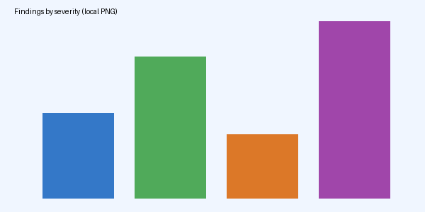

# Security Review: Payments Service

This report summarises the **automated review** of the *payments* service, with `inline code`, a [link to the docs](https://docs.example.com/payments) and ***bold italic*** text. It is written by an agent and rendered to PDF by the tools server.

## Summary

The review found **14 findings** across four severities. The chart below is a local PNG:



### Key points

- Secrets are loaded from the environment, never from files.
- The `/charge` handler validates amounts *before* calling the gateway.
  - Nested item: currency codes are checked against ISO 4217.
  - Nested item with **bold** text.
- Logging redacts card numbers.

1. Rotate the gateway API key.
2. Add rate limiting to `/refund`.
3. Enable mutual TLS between the service and the ledger.

## Findings table

| ID | Severity | Component | Description | Status |
|----|----------|-----------|-------------|--------|
| F-01 | High | charge | Amount overflow when currency has 3 decimals | Open |
| F-02 | High | refund | Missing idempotency key check allows double refunds | Open |
| F-03 | Medium | ledger | Ledger writes are not wrapped in a transaction | Fixed |
| F-04 | Medium | auth | Session cookie lacks the `SameSite` attribute | Open |
| F-05 | Low | logging | Debug log prints the full request body in staging | Fixed |
| F-06 | Low | deps | Outdated JSON library with a known DoS advisory | Open |
| F-07 | Info | docs | README references a removed endpoint | Open |
| F-08 | High | webhook | Webhook signature compared with non-constant-time equality | Open |
| F-09 | Medium | config | Default timeout of 0 means no timeout on gateway calls | Open |
| F-10 | Low | ui | Error page reveals the stack trace | Fixed |
| F-11 | Medium | retry | Retries without jitter cause thundering herd | Open |
| F-12 | Low | metrics | Cardinality explosion from per-user labels | Open |
| F-13 | Info | ci | Test coverage below 60% in the refund package | Open |
| F-14 | Medium | crypto | AES-CBC used without an HMAC | Open |

## Code sample

```go
func charge(ctx context.Context, req ChargeRequest) error {
	if req.Amount <= 0 {
		return fmt.Errorf("invalid amount %d", req.Amount)
	}
	// Call the gateway with a bounded timeout.
	ctx, cancel := context.WithTimeout(ctx, 5*time.Second)
	defer cancel()
	return gateway.Charge(ctx, req)
}
```

## International text

Chinese: 支付服务的安全审查发现了十四个问题，其中三个为高危。

Arabic (RTL): تم العثور على أربعة عشر مشكلة في خدمة الدفع، ثلاث منها عالية الخطورة.

Hindi (Devanagari): भुगतान सेवा की सुरक्षा समीक्षा में चौदह समस्याएँ मिलीं, जिनमें से तीन गंभीर हैं। क्षत्रिय श्रृंखला द्वार

Emoji: Status 🔒 secure, ✅ fixed, ⚠️ warning, 🚀 shipped, 👍🏽 approved.

Long unbroken word: Supercalifragilisticexpialidocious_aaaaaaaaaaaaaaaaaaaaaaaaaaaaaaaaaaaaaaaaaaaaaaaaaaaaaaaaaaaaaaaaaaaaaaaaaaaaaaaaaaaaaaaaaaaaaaa_end and a URL https://example.com/a/very/long/path/that/does/not/break/naturally/at/all/because/it/has/no/spaces/0123456789

> A blockquote: the report is advisory and does not replace a human review.

---

## Conclusion

Fix the three **High** findings before the next release.

## More scripts

Hebrew (RTL): סקירת האבטחה מצאה ארבעה עשר ממצאים.

Thai: การตรวจสอบความปลอดภัยพบปัญหาสิบสี่รายการ

Korean: 결제 서비스 보안 검토에서 14건의 문제가 발견되었습니다.

Japanese (kana with the Chinese font's Han): 決済サービスのセキュリティレビュー。

Bengali: নিরাপত্তা পর্যালোচনা। Tamil: பாதுகாப்பு மதிப்பாய்வு. Telugu: భద్రతా సమీక్ష.

Greek and Cyrillic: Έλεγχος ασφαλείας · Проверка безопасности.

Symbols: ✓ ✗ → ★ ∑ ∞.
